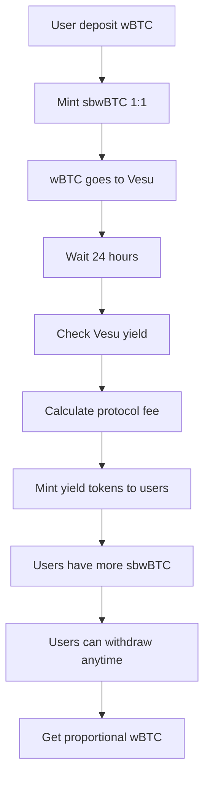

# Token Đại Diện StackBits (sbwBTC) - Phiên bản Mới

## Tổng quan

Contract `StackBitsTokenVault` đã được cập nhật theo **cơ chế phân phối lãi hàng ngày** theo yêu cầu của bạn. Token đại diện **sbwBTC** hoạt động với tỉ lệ 1:1 với wBTC ban đầu và lãi được phân phối bằng cách mint thêm tokens.

## Cách hoạt động mới

### 1. Deposit wBTC và nhận sbwBTC (Tỉ lệ 1:1)
```
User A deposit 0.7 wBTC → Nhận 0.7 sbwBTC
User B deposit 0.3 wBTC → Nhận 0.3 sbwBTC
Tổng: 1.0 wBTC → 1.0 sbwBTC
```

**Quy trình:**
1. User approve wBTC cho contract
2. User gọi `deposit(amount)` 
3. Contract transfer wBTC từ user
4. Contract deposit wBTC vào Vesu Protocol
5. Contract mint sbwBTC tokens **1:1** cho user
6. Contract track holder để phân phối lãi sau

### 2. Phân phối lãi hàng ngày (0:00 giờ)
```
Sau 1 ngày: 1.0 wBTC → 1.1 wBTC (10% lãi)
Protocol lấy phí: 10% × 0.1 = 0.01 wBTC
User nhận lãi: 0.09 wBTC (9%)
```

**Cơ chế phân phối:**
- Function `distribute_daily_yield()` được gọi mỗi ngày
- Tính total yield = total_vesu_assets - total_deposited  
- Protocol lấy phí (mặc định 10%): `protocol_fees = yield × 10%`
- User nhận lãi: `user_yield = yield - protocol_fees`
- **Mint thêm tokens** cho từng user theo tỉ lệ holdings của họ

### 3. Ví dụ phân phối cụ thể
```
Ban đầu:
- User A có: 0.7 sbwBTC (70% total supply)
- User B có: 0.3 sbwBTC (30% total supply)
- Total supply: 1.0 sbwBTC

Sau 1 ngày (9% lãi cho users):
- User A được mint thêm: 0.7 × 9% = 0.063 sbwBTC
- User B được mint thêm: 0.3 × 9% = 0.027 sbwBTC
- Total mint: 0.09 sbwBTC

Kết quả:
- User A có: 0.763 sbwBTC
- User B có: 0.327 sbwBTC  
- Total supply: 1.09 sbwBTC
```

### 4. Withdraw với lãi
```
User withdraw → Nhận wBTC tương ứng tỉ lệ trong pool
```

**Quy trình:**
1. User gọi `withdraw(shares_amount)`
2. Contract tính: `assets = (shares × total_vesu_assets) / total_supply`
3. Contract withdraw wBTC từ Vesu
4. Contract burn sbwBTC tokens của user
5. Contract transfer wBTC cho user

## Tính năng chính

### ERC20 Standard Functions
- `name()`: "StackBits wBTC Vault Token"
- `symbol()`: "sbwBTC"
- `decimals()`: 8
- `total_supply()`, `balance_of()`, `transfer()`, `approve()`, etc.

### Vault Functions  
- `deposit(assets)`: Deposit wBTC, nhận sbwBTC 1:1
- `withdraw(shares)`: Burn sbwBTC, nhận wBTC theo tỉ lệ
- `get_total_assets()`: Tổng assets trong Vesu (bao gồm lãi)
- `get_total_wbtc_deposited()`: Tổng wBTC gốc đã deposit

### Yield Distribution Functions
- `distribute_daily_yield()`: Phân phối lãi hàng ngày (mint tokens)
- `can_distribute_yield()`: Check có thể phân phối chưa (24h)
- `get_pending_yield()`: Xem lãi đang chờ phân phối
- `get_last_yield_distribution()`: Thời gian phân phối cuối

### Admin Functions
- `set_protocol_fee(percentage)`: Đặt % phí protocol (mặc định 10%)
- `collect_fees()`: Owner rút phí đã tích lũy
- `get_accumulated_fees()`: Xem phí đã tích lũy
- `pause()` / `unpause()`: Tạm dừng/tiếp tục

## Ưu điểm của cơ chế mới

### 1. **Rõ ràng và đơn giản**
- Tỉ lệ 1:1 khi deposit dễ hiểu
- Lãi được mint thêm tokens rõ ràng
- User thấy số tokens tăng lên theo thời gian

### 2. **Công bằng**
- Lãi phân phối chính xác theo tỉ lệ holdings
- Không ai bị disadvantaged bởi timing

### 3. **Gasoline efficient**
- Chỉ distribute một lần mỗi ngày
- Batch processing tất cả holders

### 4. **Protocol Revenue**
- Owner có revenue stream từ phí
- Fee có thể điều chỉnh (tối đa 50%)

## Luồng hoạt động hoàn chỉnh



## Technical Implementation

### Holder Tracking
- Contract track tất cả token holders
- Efficient iteration để mint yield tokens
- Automatic add/remove khi balance thay đổi

### Daily Distribution
- `distribute_daily_yield()` có thể được gọi bởi ai
- Check 24h cooldown period
- Distribute to all active holders in one transaction

### Example Usage

```javascript
// Deploy contract
const vault = await deploy("StackBitsTokenVault", [
    ownerAddress,
    wbtcAddress, 
    vesuVaultAddress
]);

// User deposit
await wbtc.approve(vault.address, wbtcAmount);
await vault.deposit(wbtcAmount); // Get 1:1 sbwBTC

// Wait 24+ hours, then distribute yield
await vault.distribute_daily_yield(); // Anyone can call

// Check new balance (should be higher)
const newBalance = await vault.balance_of(userAddress);

// Withdraw with yield
await vault.withdraw(newBalance); // Get wBTC + accumulated yield
```

Cơ chế này hoàn toàn đáp ứng yêu cầu của bạn: **1:1 deposit, daily yield distribution via token minting, protocol fees, và withdrawal với lãi tích lũy!**
